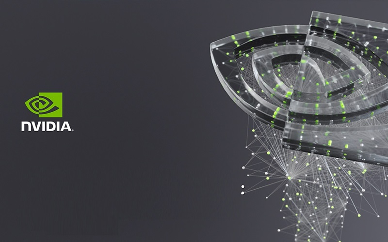

# Brain Tumor Detection on Jetson Nano



## 🎯Project Objective
This project aims to deploy a PyTorch-based brain tumor detection model on the NVIDIA Jetson Nano, demonstrating the capability of edge devices in medical image analysis.

### 🛠️ Methods Used
- Deep Learning
- Computer Vision
- Edge Computing
- GUI Development

### 💻Technologies
- Python 3.12
- PyTorch
- TorchScript
- NVIDIA Jetson Nano
- TensorRT (optional)
- Tkinter

## 📝 Project Description
This project involves setting up a Jetson Nano device, upgrading its software, and deploying a pre-trained PyTorch model for brain tumor detection. The model classifies MRI images into four categories: glioma tumor, meningioma tumor, no tumor, and pituitary tumor.

Key steps in the project:
1. Setting up the Jetson Nano with the latest software
2. Transferring the PyTorch model to the device
3. Creating a deployment script for model inference
4. Optimizing the model using TensorRT (optional)
5. Developing a simple GUI for easy interaction with the model

## Getting Started

### 📋 Prerequisites
- NVIDIA Jetson Nano
- 32 GB microSD card
- 5V⎓2A power supply
- Display, keyboard, and mouse for initial setup

### 📦 Jetson Nano Setup
1. Upgrade Ubuntu and Python on the Jetson Nano
2. Set up a Python virtual environment
3. Install required Python packages (PyTorch, torchvision, etc.)

## 🖱️Usage
1. Launch the GUI: `python deploy_model_gui.py`
2. Click "Select Image" to choose an MRI image for analysis
3. View the prediction result displayed on the GUI

## Project Structure

```
brain-tumor-detection-jetson/
├── img/
│   ├── jnano.jpg
│   └── ...
├── journal.md
├── deploy_model.py
├── deploy_model_gui.py
├── README.md
```

## 🔗 Model Source
The PyTorch model used in this project was trained using the code from the following repository:
[MRI_Tumor_Classification_Pytorch](https://github.com/ansamz/MRI_Tumor_Classification_Pytorch)

This repository contains the training code and methodology for the brain tumor classification model deployed on the Jetson Nano in this project.
