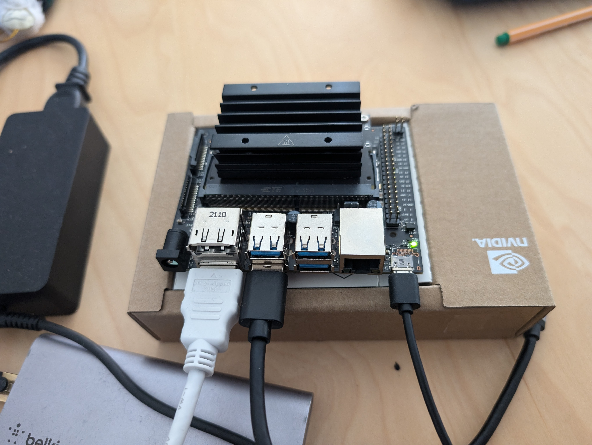

# Getting started


1. attached a 32 GB microSD card.
2. connected it to a power supply that can deliver 5V⎓2A.
3. Download the Jetson Nano Developer Kit SD Card Image. can be found [here](https://developer.nvidia.com/embedded/downloads#?search=image).
4. insert the SD card in your computer.

The instructions to follow are for Linux:

> **_NOTE:_** The user guide instructions using etcher didn't work so I used this methos instead.

1. unzip the image
2. run this command: sudo dd if=Downloads/sd-blob-b01.img of=/dev/mmcblk0 bs=1M
3. Eject the SD card from computer via command line or file application.

On the Jetson NANO:
1. nsert the microSD card (with system image already written to it) into the slot on the underside of the Jetson Nano module.
2. connect the jetson nano to the power supply, computer display, USB keyboard and mouse.



3. you'll see an ubuntu screen, follow the instruction, choose a language and so on (easy ubuntu setup).
4. Set username: ansamz, and Password: ****************** (shall be given upon request :D)
5. We get to initial setup mode.

[JETSON developer guide](https://docs.nvidia.com/jetson/archives/r34.1/DeveloperGuide/index.html)

[Hello AI World](https://developer.nvidia.com/embedded/twodaystoademo#hello_ai_world), this link contains fun demos to try to deploy.

# Model deployment:

Reading the documentation in [this](https://github.com/dusty-nv/jetson-inferences) repository helped me a lot to get a grasp of using the Jetson Nano.

There are multiple options there for example [buillding a project from source](https://github.com/dusty-nv/jetson-inference/blob/master/docs/building-repo-2.md).

**Here are the steps I followed to deploy my PyTorch model on the Jetson Nano:**

I'll use the TorchScript version, as it's generally easier to deploy on edge devices.


> **Note:** I also have the ONNX version, check out this [repository](https://github.com/ansamz/MRI_Tumor_Classification_Pytorch) where I trained the model and converted it to ONNX and TorchScript


1. **Transfer the model to Jetson Nano**:
   Use SCP or a USB drive to transfer `best_model_traced_TorchScript.pt` to the Jetson Nano.

2. **Set up the Python environment on Jetson Nano**:

The python version installed on the JETSON NANO is 3.8.10, an old version that created problems running pytorch, the error was:

`Illegal instruction(core dumped)`


To upgrade Ubuntu and Python on the Jetson Nano, I followed these steps:

a. **Remove Chromium and OpenCV** (as they can interfere with the upgrade process):
   ```bash
   sudo apt-get remove --purge chromium-browser chromium-browser-l10n
   ```

b. **Update and upgrade the system**:
   ```bash
   sudo apt-get update
   sudo apt-get install nano
   sudo apt-get upgrade
   sudo apt-get autoremove
   ```

c. **Modify the release upgrade settings**:
   ```bash
   sudo nano /etc/update-manager/release-upgrades
   ```
   In this file, change `prompt = never` to `prompt = normal`

d. **Perform the distribution upgrade**:
   ```bash
   sudo apt-get update
   sudo apt-get dist-upgrade
   sudo reboot
   ```

e. **Install Python 3.12**:
   ```bash
   sudo apt update && sudo apt upgrade -y
   sudo add-apt-repository ppa:deadsnakes/ppa
   sudo apt update
   apt list | grep python3.12
   sudo apt install python3.12
   ```

After upgrading Ubuntu and Python:

   ```bash
   sudo apt-get update
   sudo apt-get install python3.12-pip

   sudo apt-get update # needed to run an update again for installing the environment without issues

   sudo apt install python3.12-venv
   python3.12 -m venv mri_detector-env
   source mri_detector-env/bin/activate
   pip3 install --upgrade pip
   pip3 install torch torchvision
   ```

3. **Create a deployment script to test the model**:
   Create a new Python file, e.g., `deploy_model.py`, with the following content:

```python:deploy_model.py
import torch
import torchvision.transforms as transforms
from PIL import Image

model = torch.jit.load('best_model_traced_TorchScript.pt', map_location=torch.device('cpu'))
model.eval()

print("model eval done")

transform = transforms.Compose([
    transforms.Resize((150, 150)),
    transforms.ToTensor(),
    transforms.Normalize([0.5, 0.5, 0.5], [0.5, 0.5, 0.5])])

classes = ['glioma_tumor', 'meningioma_tumor', 'no_tumor', 'pituitary_tumor']

def predict(image_path):
    image = Image.open(image_path)
    image = transform(image).unsqueeze(0)

    print("predicting")
    with torch.no_grad():
        outputs = model(image)
        _, predicted = torch.max(outputs, 1)
        print("done predicting")
    return classes[predicted[0].item()]

test_image_path = 'no_image(3).jpg'
prediction = predict(test_image_path)
print(f"Predicted calss is: {prediction}")
```

4. **Run the deployment script**:
   ```bash
   python3 deploy_model.py
   ```

5. **Optimize for Jetson Nano (optional)**:
   To get better performance, you can use TensorRT:

   ```bash
   sudo apt-get install python3-pip libopenblas-base libopenmpi-dev 
   pip3 install numpy torch torchvision
   ```

   Then modify your `deploy_model.py` to use TensorRT:

```python:deploy_model.py
import torch
import torchvision.transforms as transforms
from PIL import Image
import torch2trt

model = torch.jit.load('best_model_traced_TorchScript.pt')
model.eval()

x = torch.randn((1, 3, 150, 150)).cuda()
model_trt = torch2trt.torch2trt(model, [x])

# ... rest of the code remains the same ...

def predict(image_path):
    image = Image.open(image_path)
    image = transform(image).unsqueeze(0).cuda()

    with torch.no_grad():
        outputs = model_trt(image)
        _, predicted = torch.max(outputs, 1)

    return classes[predicted[0].item()]

# ... rest of the code remains the same ...
```

6. **Create a simple UI**:
   For graphical interface, you can use libraries like Tkinter:

Installation:

   ```bash
   sudo apt-get install python3-tk
   pip3 install Pillow
   ```

After ensuring these are installed, you should be able to run the UI script without any additional library installations.

```python:deploy_model_gui.py
import tkinter as tk
from tkinter import filedialog
from PIL import Image, ImageTk
import torch
import torchvision.transforms as transforms

# ... (load model and define predict function as before) ...

def select_image():
    file_path = filedialog.askopenfilename()
    if file_path:
        image = Image.open(file_path)
        image = image.resize((300, 300))
        photo = ImageTk.PhotoImage(image)
        img_label.config(image=photo)
        img_label.image = photo
        result = predict(file_path)
        result_label.config(text=f"Prediction: {result}")

root = tk.Tk()
root.title("Brain Tumor Detector")

select_button = tk.Button(root, text="Select Image", command=select_image)
select_button.pack()

img_label = tk.Label(root)
img_label.pack()

result_label = tk.Label(root, text="Prediction: ")
result_label.pack()

root.mainloop()
```

