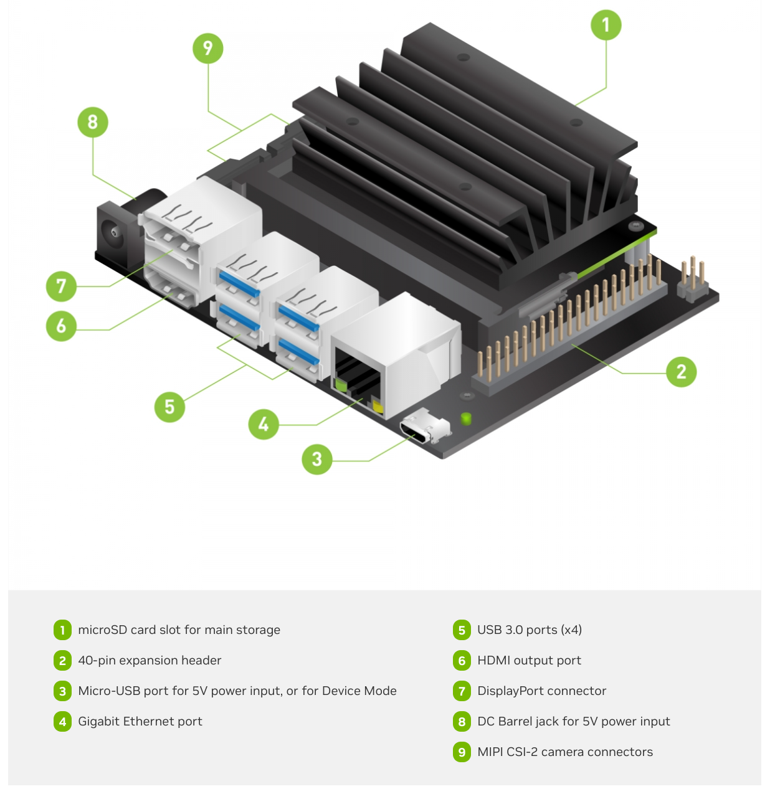

# Getting started

1. attached a 32 GB microSD card.
2. connected it to a power supply that can deliver 5V⎓2A.
3. Download the Jetson Nano Developer Kit SD Card Image. can be found [here](https://developer.nvidia.com/embedded/learn/get-started-jetson-nano-devkit#write).

The instructions to follow are for Linux:
1. Install etcher from etcher.balena.io
2. First downloaded the AppImage balenaEtcher-1.19.21-arm64.dmg from https://github.com/balena-io/etcher/releases/
3. gave it permission to be an executable 
4. in the terminal executed this line "./balenaEtcher-1.19.21-arm64.dmg --no-sandbox"
5. Click “Select image” and choose the zipped image file downloaded earlier.
6. 
